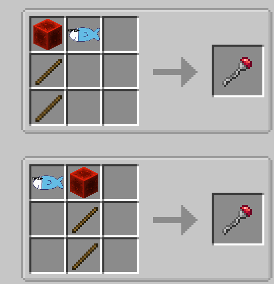
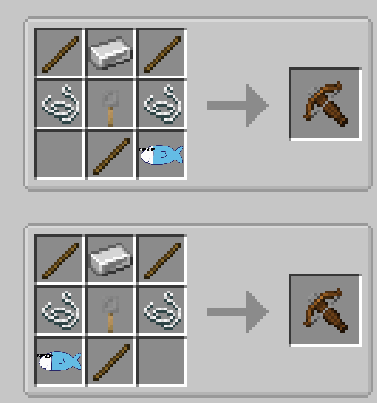
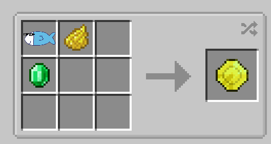
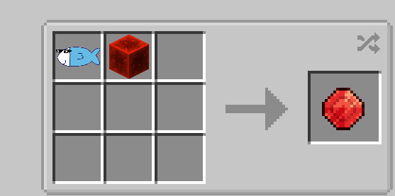
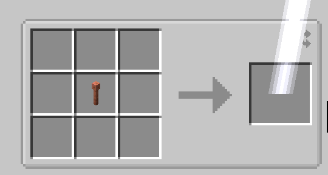
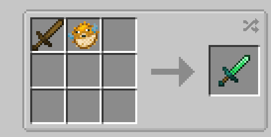

<p align="center"><br></p>
<h1 align="center">马夫鱼：合成 (Mafish Crafting)</h1>


将马夫鱼模组内的物品添加合成配方  
请使用JEI来查看本Mod添加的配方  
**需要mafish-learning 0.0.5以上版本**

## ℹ️ 添加的部分配方
### 马夫鱼
- 非常重要，本模组的大部分配方都需要它
- 钓鱼  
- 渔夫小屋的箱子
### 其他
  
  
  
其他的图片见`img`文件夹


## ⚒️ 构建
虽然这个Mod是使用MCreator制作的，但是你也可以通过传统方法更改和构建  
```shell
# 安装了gradle
gradle build

# 没安装gradle
# 如果你是中国大陆用户，请将gradle/wrapper/gradle-wrapper.properties的两个distributionUrl的注释互换
./gradlew build
```
数据包直接zip打包`src/main/resources`里的全部文件


## ❗ 已知问题
可能会覆盖掉其他Mod的钓鱼，渔夫小屋的战利品表

## ❓ FAQ
1. 数据包？
   - 可能会同时出

2. 我可以把这个Mod加入整合包吗？
   - 可以，只要证明你的Mod不是你创作的，甚至你直接JIJ (jar in jar)了都可以

3. 网易？
   - 欢迎搬运，只要不收费并给出Modrinth和CurseForge的链接，并说明这是搬运的就可以了
   - 对于本模组的前置搬运，请先征得马夫鱼的同意