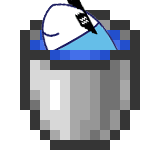

<h1 align="center">Mafish Extras Collection</h1>
这个仓库以分支的形式设成了多个Mod或数据包，在拓展马夫鱼模组的玩法外，让生存模式的玩家也能获取到Mod的内容

每个分支都有一个单独的README，请前往各个分支查看

## 不要为本仓库的 分支<-分支 创建拉取请求
但是你仍然可以以fork的形式创建PR

比如： SystemFileB/mafish-extras:mafish-crafting <- EEEEEEE/mafish-extras:mafish-crafting  
这种PR是可以接收的